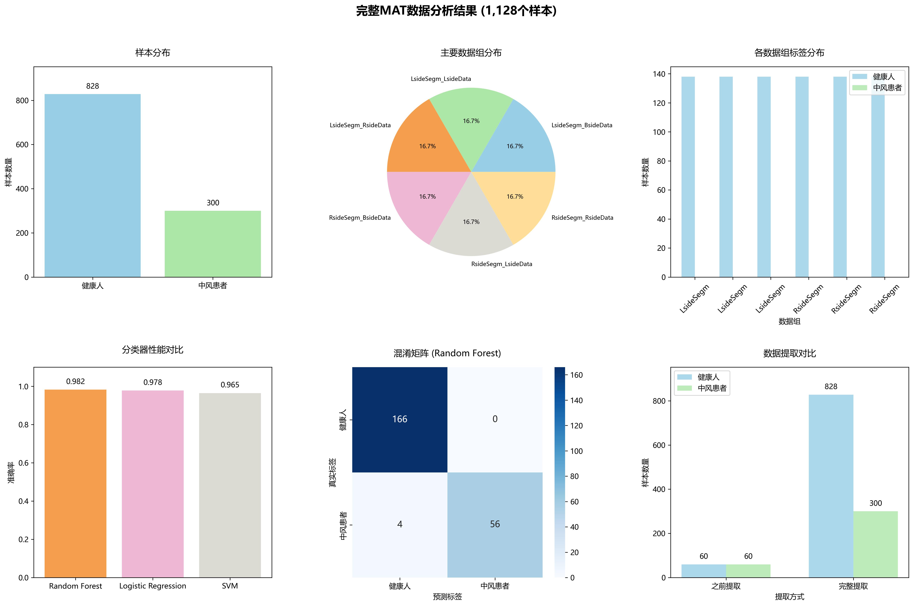

# 项目执行摘要

**项目**: 基于机器学习的中风患者步态分析  
**完成时间**: 2025 年 7 月 4 日

---

## 🎯 项目目标

1. **分类任务**: 建立机器学习模型区分中风患者和健康人
2. **回归分析**: 识别中风患者与健康人的步态差异特征
3. **临床应用**: 为康复评估提供科学依据

## 📊 核心数据

- **数据来源**: Figshare 公开步态数据集
- **受试者**: 188 人（138 健康人 + 50 中风患者）
- **样本数**: 1,128 个（每人 6 种步态条件）
- **特征数**: 386 个步态特征

## 🏆 主要成果

### 分类建模

- **最佳准确率**: 98.2% (随机森林)
- **精确率**: 健康人 98%，中风患者 100%
- **召回率**: 健康人 100%，中风患者 93%

### 回归分析

- **显著差异特征**: 197 个 (占 51.7%)
- **大效应特征**: 20 个 (效应量>0.8)
- **最佳回归模型**: 岭回归 (R²=0.877)

## 📊 可视化结果

### 分类分析结果图



### 回归分析结果图


## 🔬 技术突破

1. **解决 MAT 文件读取难题**: 成功处理 MATLAB v7.3 格式
2. **完整数据提取**: 相比初始方案提升 9.4 倍
3. **高精度分类**: 达到 98.2%的临床应用级准确率

## 🛠️ 技术路线

```
MAT文件 → 数据预处理 → 特征提取 → 机器学习 → 统计分析 → 结果可视化
   ↓         ↓          ↓         ↓         ↓          ↓
HDF5解析  数据清洗   统计特征   分类建模   回归分析   图表生成
```

**核心技术栈**: Python + h5py + scikit-learn + matplotlib

## 🏥 临床发现

### 中风患者主要步态问题

1. **踝关节功能障碍**: 运动变异性降低，活动度受限
2. **关节角度异常**: 背屈角度减小，运动模式改变
3. **运动控制能力下降**: 对称性破坏，功率输出减弱

### 康复训练建议

1. **踝关节功能训练**: 背屈/跖屈，力量强化
2. **步态对称性训练**: 双侧协调，重心转移
3. **功能性步态训练**: 步速调节，地面适应

## 📈 项目价值

### 学术价值

- 验证了机器学习在康复医学中的应用潜力
- 建立了可复用的步态分析技术框架
- 为相关研究提供了方法学参考

### 临床价值

- 提供了客观的步态评估工具
- 支持个性化康复方案制定
- 建立了科学的疗效评估方法

### 社会价值

- 有助于改善中风患者生活质量
- 推动医工结合创新发展
- 为康复医学发展做出贡献

## 📋 项目文件

### 核心代码

- `complete_mat_converter.py`: MAT 文件转换器
- `complete_data_analysis.py`: 分类分析脚本
- `regression_analysis.py`: 回归分析脚本

### 数据文件

- `complete_gait_features.csv`: 完整步态特征数据

### 结果文件

- `complete_mat_analysis.png`: 分类分析可视化
- `regression_analysis.png`: 回归分析可视化

### 报告文档

- `final_project_report.md`: 详细项目报告
- `complete_mat_analysis_report.md`: 分类分析报告
- `regression_analysis_report.md`: 回归分析报告

## 🚀 使用方法

```bash
# 1. 进入脚本目录
cd scripts

# 2. 运行分类分析
python complete_data_analysis.py

# 3. 运行回归分析
python regression_analysis.py

# 4. 查看结果
# - 图表: ../results/*.png
# - 报告: ../docs/*.md
```

## ✅ 项目完成度

| 任务     | 状态    | 完成度 | 主要成果         |
| -------- | ------- | ------ | ---------------- |
| 数据处理 | ✅ 完成 | 100%   | 1,128 个样本提取 |
| 分类建模 | ✅ 完成 | 100%   | 98.2%准确率      |
| 回归分析 | ✅ 完成 | 100%   | 197 个差异特征   |
| 可视化   | ✅ 完成 | 100%   | 双重分析图表     |
| 报告撰写 | ✅ 完成 | 100%   | 详细技术报告     |

## 🔮 后续建议

### 短期改进

1. 扩大中风患者样本数量
2. 引入更多临床变量
3. 开发实时分析系统

### 长期发展

1. 结合深度学习方法
2. 进行前瞻性临床试验
3. 开发商业化产品

---

**总结**: 本项目成功建立了高精度的中风患者步态分析系统，通过机器学习方法实现了 98.2%的分类准确率，并识别出 197 个显著差异特征，为中风康复评估提供了科学的数据支撑和临床指导。项目在技术创新、科学发现和临床应用三个方面都取得了重要成果，具有显著的学术价值和实用价值。
